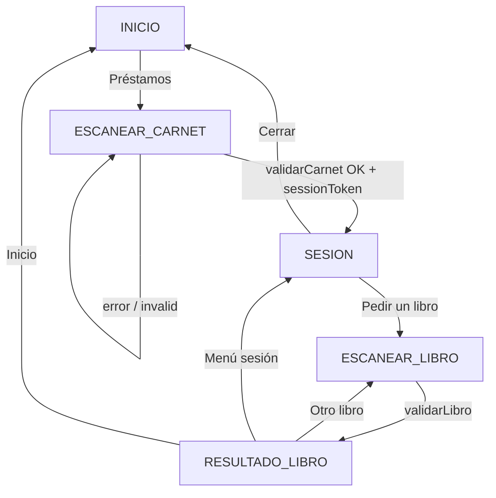

# Documentación técnica — Sistema de Autopréstamos (frontend)

Este documento describe el funcionamiento del **frontend** de Autopréstamos para que otro desarrollador pueda entender la arquitectura, los flujos de usuario, el contrato con el backend y las herramientas de desarrollo.

---

## 1. Propósito del sistema

La aplicación es un **kiosco web** orientado a la biblioteca de UNAPEC: permite al usuario **identificarse con el carnet** (código de barras + foto) y luego **solicitar el préstamo de un libro** escaneando el ejemplar. El texto de la interfaz indica que la **lógica de negocio real** (disponibilidad, límites, sanciones, registro en Koha) la resuelve un **servidor** que integra con **Koha**.

Este repositorio contiene **solo el cliente React**; no incluye el backend Python u otro servicio que deba implementar los endpoints descritos en la sección 6.

---

## 2. Stack tecnológico

| Área | Tecnología |
|------|------------|
| Framework UI | React 19 |
| Bundler / dev server | Vite 8 |
| Lectura de códigos | [@zxing/browser](https://github.com/zxing-js/library) (1D/2D) |
| Estilos | CSS modular (`App.css`, `index.css`, CSS por componente) |

- Punto de entrada HTML: `index.html` (idioma `es`, título institucional).
- Montaje de React: `src/main.jsx` con `StrictMode`.

---

## 3. Estructura del repositorio

```
├── index.html              # Shell HTML
├── vite.config.js          # Proxy /api → backend local
├── public/
│   └── unapec-logo.png     # Logo (atribución en README)
└── src/
    ├── main.jsx            # createRoot + StrictMode
    ├── App.jsx             # Flujo principal y estados de pantalla
    ├── App.css             # Layout, paneles, botones
    ├── index.css           # Estilos globales / reset
    ├── api/
    │   ├── loansApi.js     # Fetch real + delegación a mock
    │   ├── mockConfig.js   # Flags y escenarios de simulación
    │   └── mockLoansApi.js # Respuestas simuladas
    ├── components/
    │   ├── CameraScanner.jsx  # Cámara, ZXing, captura, entrada manual
    │   ├── UnapecLogo.jsx
    │   └── UnapecLogo.css
    └── dev/
        ├── DevMockPanel.jsx   # Panel flotante solo en desarrollo
        └── mockShortcuts.js   # Objeto de sesión mínimo para atajos UI
```

No hay enrutador (React Router): la navegación es **por estado** dentro de `App.jsx`.

---

## 4. Modelo de navegación: máquina de estados

Todo el flujo se controla con la variable `step` y el objeto `STEPS` en `App.jsx`:

| Constante | Significado |
|-----------|-------------|
| `INICIO` | Pantalla de bienvenida y botón «Préstamos». |
| `ESCANEAR_CARNET` | `CameraScanner` para carnet; al éxito se guarda sesión Koha. |
| `SESION` | Usuario identificado; puede ir a pedir libro o cerrar. |
| `ESCANEAR_LIBRO` | `CameraScanner` para el ejemplar; requiere `sessionToken`. |
| `RESULTADO_LIBRO` | Muestra éxito o rechazo del préstamo según respuesta del API. |

### Estado adicional relevante

- **`kohaSession`**: `{ patronId?, sessionToken?, displayName? } | null`. Se asigna cuando `validarCarnet` devuelve `valid: true` y un objeto `koha` con `sessionToken`.
- **`bookResult`**: respuesta de `validarLibro` (`valid`, `message`, `libro`, etc.).
- **`cardScanKey` / `bookScanKey`**: se incrementan para **forzar remount** de `CameraScanner` (reiniciar cámara y lector) tras error o al reintentar.
- **`loading`**, **`cardError`**, **`bookError`**: feedback durante llamadas al servidor.

### Función `goInicio`

Resetea paso, sesión, errores, resultado y ambas keys de escaneo — vuelve el kiosco al estado inicial limpio.

---

## 5. Componentes principales

### 5.1 `App.jsx`

- Orquesta los pasos y llama a `validarCarnet` / `validarLibro` desde `loansApi.js`.
- En **modo desarrollo** (`import.meta.env.DEV`), monta `DevMockPanel` con callbacks que saltan pantallas o simulan resultados sin pasar por la API real.

### 5.2 `CameraScanner.jsx`

Responsabilidades:

1. **Solicitar permisos** y mostrar video en vivo (`facingMode: 'environment'`).
2. **Decodificar códigos en vivo** con `BrowserMultiFormatReader` y una lista amplia de formatos (QR, Code128, EAN, etc.) y `TRY_HARDER`.
3. Al detectar un código **en video**: congela un **blob de imagen** (fotograma) y llama `onCapture({ barcodeText, imageBlob })`.
4. **Botón «Capturar foto y leer código»**: alternativa para dispositivos donde el video es peor que un fotograma fijo; usa `ImageCapture.takePhoto()` en Edge cuando está disponible (evita fallos de `canvas.toBlob` con video HD).
5. **Entrada manual**: si el lector falla, el usuario escribe el código; se envía una imagen del último fotograma, la «foto guardada» (`stalePhotoBlob`), o un **placeholder** generado en canvas si no hay cámara activa (`manualPlaceholderBlob`).

Fases internas (`phase`): `idle` → `starting` → `scanning` → `detected` → `done` (y `error` si aplica). El efecto que arranca la cámara depende de `[busy]` para no reabrir el stream mientras hay petición en curso.

**Contrato de `onCapture`**: siempre recibe `barcodeText` (string) e `imageBlob` (Blob) para que el backend pueda auditar o procesar la imagen además del código.

### 5.3 `UnapecLogo.jsx`

Muestra `/unapec-logo.png` desde `public/` con estilos en `UnapecLogo.css`.

### 5.4 `DevMockPanel.jsx` (solo desarrollo)

- FAB «Mock» que abre un panel.
- Activa/desactiva simulación vía `sessionStorage` (clave `autoprestamos_use_mock`).
- Selector de **escenario** (`autoprestamos_mock_scenario`) que altera respuestas en `mockLoansApi.js`.
- Botones de **atajo** para ir a pantallas sin usar la cámara.

---

## 6. Capa API (`src/api/loansApi.js`)

### 6.1 Modo real (producción o dev sin mock)

Las peticiones van a rutas relativas `/api/...` salvo que se defina **`VITE_API_BASE_URL`**: en ese caso la URL final es `base + path` (se elimina la barra final del base si existe).

| Método | Ruta | Cuerpo | Cabeceras |
|--------|------|--------|-----------|
| POST | `/api/prestamos/validar-carnet` | `multipart/form-data`: campo `foto` (JPEG), `codigoBarras` | — |
| POST | `/api/prestamos/validar-libro` | igual | `Authorization: Bearer <sessionToken>` |

Respuestas esperadas (JSON):

**Validar carnet (200)**

```json
{
  "valid": true,
  "message": "opcional",
  "koha": {
    "patronId": "…",
    "sessionToken": "…",
    "displayName": "opcional"
  }
}
```

Si `valid` es `false`, el front muestra `message` y reintenta el escaneo del carnet.

**Validar libro (200)**

```json
{
  "valid": true,
  "message": "opcional",
  "libro": {
    "titulo": "…",
    "itemNumber": "…"
  }
}
```

Errores HTTP: el cliente intenta parsear JSON; si falla, usa el texto crudo como `message`. Lanza `Error` con propiedades opcionales `status` y `body`.

### 6.2 Proxy de Vite en desarrollo

En `vite.config.js`, las peticiones a `/api` se proxifican a **`http://127.0.0.1:4000`**. Así el front en `npm run dev` puede hablar con un backend local sin CORS extra, siempre que el servidor escuche en ese puerto.

### 6.3 Modo mock (`mockConfig.js` + `mockLoansApi.js`)

El mock **nunca se usa en producción** (`import.meta.env.PROD` → `isMockApiEnabled()` es `false`).

En desarrollo, el mock está activo si:

- `VITE_USE_MOCK_API=true` en variables de entorno de Vite, **o**
- `sessionStorage.getItem('autoprestamos_use_mock') === '1'` (lo pone el panel dev).

El **escenario** se lee de `sessionStorage` (`autoprestamos_mock_scenario`) o por defecto `full_success`.

| Escenario | Efecto en carnet | Efecto en libro |
|-----------|------------------|-----------------|
| `full_success` | Carnet OK | Préstamo OK |
| `carnet_rechazado` | `valid: false` | — |
| `carnet_error` | Lanza error (simula red) | — |
| `libro_rechazado` | Carnet OK | `valid: false` con mensaje |
| `libro_error` | Carnet OK | Lanza error |

Los mocks hacen `console.info('[mock API]', …)` con tamaño de foto y código para depuración.

---

## 7. Variables de entorno (Vite)

Prefijo obligatorio: **`VITE_`** para exponer variables al cliente.

| Variable | Uso |
|----------|-----|
| `VITE_API_BASE_URL` | URL base del API (opcional). Si está vacío, se usan rutas relativas `/api/...`. |
| `VITE_USE_MOCK_API` | Si es `true`, fuerza API simulada en desarrollo (además del checkbox del panel). |

Archivo típico: `.env.local` en la raíz del proyecto (no commitear secretos; aquí solo URLs y flags de dev).

---

## 8. Flujos resumidos (diagrama lógico)



---

## 9. Cómo ejecutar el proyecto

```bash
npm install
npm run dev
```

- Build producción: `npm run build`
- Vista previa del build: `npm run preview`
- Lint: `npm run lint`

Para probar contra backend real: levantar el servicio en **puerto 4000** (o ajustar el `target` del proxy en `vite.config.js`) y **desactivar** el mock en el panel o no definir `VITE_USE_MOCK_API`.

---

## 10. Integración futura / checklist backend

Quien implemente el servidor debe:

1. Exponer los dos endpoints con el contrato multipart y cabecera Bearer del libro.
2. Validar carnet (foto + código), crear o recuperar sesión contra Koha y devolver `sessionToken` opaco para el cliente.
3. En préstamo de libro, usar ese token para identificar al usuario en Koha, aplicar reglas y devolver `valid` + `message` + metadatos del libro.
4. Asegurar CORS o mismo origen si en producción el front y el API no van juntos (el proxy de Vite solo aplica en desarrollo).

---

## 11. Limitaciones y notas operativas

- **HTTPS / localhost**: la cámara requiere contexto seguro o localhost; en dispositivos reales conviene servir el kiosco con HTTPS.
- **Edge / Windows**: el código contempla limitaciones de `canvas.toBlob` con video; prioriza `ImageCapture` cuando existe.
- **Accesibilidad**: hay `aria-live`, `role="alert"` en errores y etiquetas en video; revisar contrastes si se cambia el tema en CSS.

---

## 12. Referencias rápidas de archivos

| Necesidad | Archivo |
|-----------|---------|
| Cambiar flujo o textos de pantallas | `src/App.jsx` |
| Contrato HTTP y URL base | `src/api/loansApi.js` |
| Comportamiento del escáner | `src/components/CameraScanner.jsx` |
| Escenarios de prueba sin backend | `src/api/mockLoansApi.js`, `mockConfig.js`, `dev/DevMockPanel.jsx` |
| Proxy dev | `vite.config.js` |

---

*Documento generado para el equipo de desarrollo. Actualizar este archivo si se añaden rutas, nuevos pasos del flujo o cambios en el contrato del API.*
