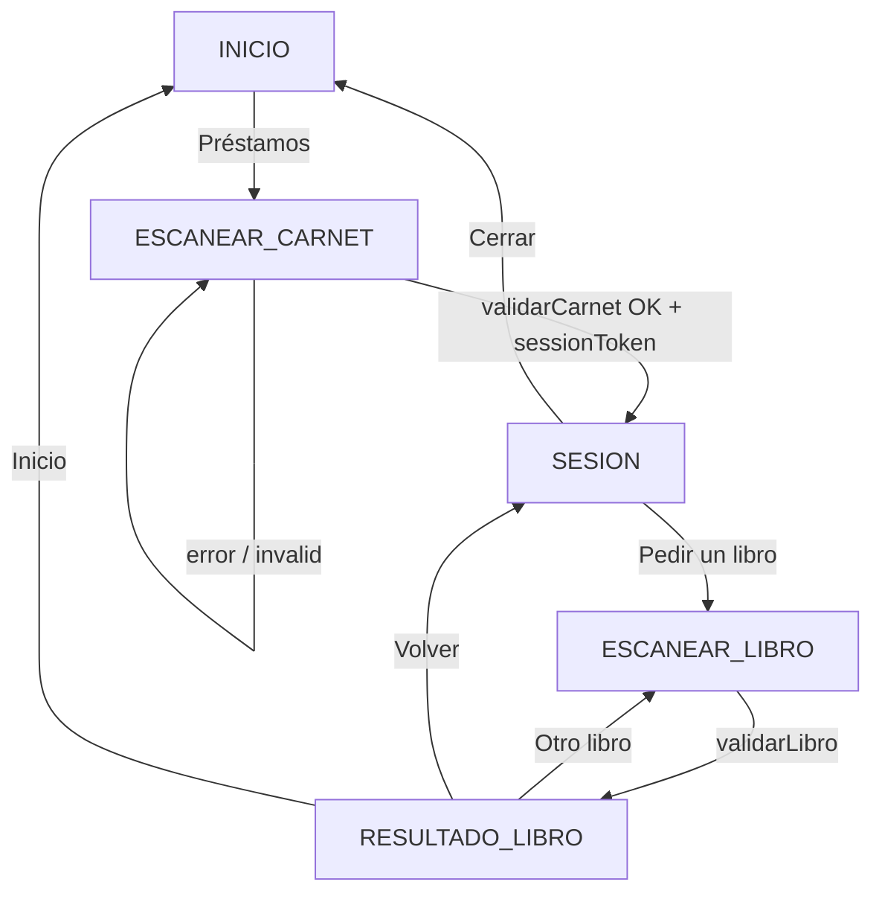

# Documentación técnica — Sistema de Autopréstamos (frontend)

Este documento describe el funcionamiento del **frontend** de Autopréstamos para que otro desarrollador pueda entender la arquitectura, los flujos de usuario, el contrato con el backend y las herramientas de desarrollo.

---

## 1. Propósito del sistema

La aplicación es un **kiosco web** orientado a la biblioteca de UNAPEC: permite al usuario **identificarse con el carnet** enviando una **foto** capturada con la cámara y luego **solicitar el préstamo de un libro** enviando otra foto del ejemplar. La **decodificación del código** (si aplica) la hace el **servidor** sobre la imagen. La **lógica de negocio real** (disponibilidad, límites, sanciones, registro en Koha) la resuelve el backend que integra con **Koha**.

Este repositorio contiene **solo el cliente React**; no incluye el backend Python u otro servicio que deba implementar los endpoints descritos en la sección 6.

---

## 2. Stack tecnológico

| Área | Tecnología |
|------|------------|
| Framework UI | React 19 |
| Bundler / dev server | Vite 8 |
| Cámara | `getUserMedia` + captura a `Blob` (JPEG/PNG según el navegador) |
| Estilos | CSS modular (`App.css`, `index.css`, CSS por componente) |

- Punto de entrada HTML: `index.html` (idioma `es`, título institucional).
- Montaje de React: `src/main.jsx` con `StrictMode`.

---

## 3. Estructura del repositorio

```
├── index.html              # Shell HTML
├── vite.config.js          # Proxy /api → backend local
├── scripts/
│   └── dev-upload-echo.mjs # Servidor de eco multipart (dev, puerto 4010)
├── public/
│   ├── unapec-logo.png     # Logo (atribución en README)
│   ├── favicon.svg
│   └── icons.svg
└── src/
    ├── main.jsx            # createRoot + StrictMode
    ├── App.jsx             # Flujo principal y estados de pantalla
    ├── App.css             # Layout, paneles, botones
    ├── index.css           # Estilos globales / reset
    ├── api/
    │   ├── loansApi.js       # Fetch real + delegación a mock
    │   ├── userFacingError.js # Errores HTTP/red → textos para el panel del kiosco
    │   ├── mockConfig.js     # Flags y escenarios de simulación
    │   └── mockLoansApi.js   # Respuestas simuladas
    ├── components/
    │   ├── HomeWelcome.jsx         # Inicio (pasos + CTA)
    │   ├── SessionActivePanel.jsx   # Sesión tras carnet verificado
    │   ├── BookLoanResultPanel.jsx # Resultado préstamo ejemplar (éxito / rechazo)
    │   ├── CameraScanner.jsx       # Cámara y captura de foto para el backend
    │   ├── UnapecLogo.jsx
    │   └── UnapecLogo.css
    └── dev/
        ├── DevMockPanel.jsx   # Panel flotante solo en desarrollo
        └── mockShortcuts.js   # Objeto de sesión mínimo para atajos UI
```

No hay enrutador (React Router): la navegación es **por estado** dentro de `App.jsx`.

---

## 4. Modelo de navegación: máquina de estados

Todo el flujo se controla con la variable `step` y el objeto `STEPS` en `App.jsx`:

| Constante | Significado |
|-----------|-------------|
| `INICIO` | Pantalla de bienvenida y botón «Préstamos». |
| `ESCANEAR_CARNET` | `CameraScanner` para carnet; al éxito se guarda sesión Koha. |
| `SESION` | `SessionActivePanel`: usuario identificado; pedir libro o salir. |
| `ESCANEAR_LIBRO` | `CameraScanner` para el ejemplar; requiere `sessionToken`. |
| `RESULTADO_LIBRO` | `BookLoanResultPanel`: éxito o rechazo del préstamo según el API. |

### Estado adicional relevante

- **`kohaSession`**: `{ patronId?, sessionToken?, displayName? } | null`. Se asigna cuando `validarCarnet` devuelve `valid: true` y un objeto `koha` con `sessionToken`.
- **`bookResult`**: respuesta de `validarLibro` (`valid`, `message`, `libro`, etc.). Con **respuesta HTTP 200** siempre se pasa a **RESULTADO_LIBRO**, tanto si `valid` es `true` como si es `false` (el rechazo de negocio se muestra en `BookLoanResultPanel`, no como error de red).
- **`cardScanKey` / `bookScanKey`**: se incrementan para **forzar remount** de `CameraScanner` (reiniciar cámara) tras error o al reintentar.
- **`loading`**: estado de las peticiones al API.
- **`cardError` / `bookError`**: objetos `{ title, detail, codeLabel? }` para **`PanelApiError`**. Carnet inválido o sin `koha.sessionToken` arma el objeto en **`handleCardCapture`**; excepciones de red o HTTP no OK usan **`getUserFacingApiError`** (`userFacingError.js`) en `catch`. Al aparecer cualquiera de los dos errores, un efecto hace **scroll** suave al bloque del aviso.

### Función `goInicio`

Resetea paso, sesión, errores, resultado y ambas keys de escaneo — vuelve el kiosco al estado inicial limpio.

---

## 5. Componentes principales

### 5.1 `App.jsx`

- Orquesta los pasos y llama a `validarCarnet` / `validarLibro` desde `loansApi.js`.
- **`PanelApiError`**: panel local de alerta (icono, título, detalle, código HTTP opcional) para `cardError` y `bookError`.
- Tras **carnet**: solo entra en **SESION** si `data.valid` y existe `data.koha.sessionToken`; en caso contrario muestra error y permanece en **ESCANEAR_CARNET** (incrementa `cardScanKey`).
- En **modo desarrollo** (`import.meta.env.DEV`), monta `DevMockPanel` con callbacks (`goEscanearCarnetDev`, `goSesionMockDev`, etc.) que saltan pantallas o simulan resultados sin pasar por la API real.

### 5.2 `HomeWelcome.jsx`

Pantalla **INICIO**: título, texto explicativo, tres pasos con iconos (flujo continuo con separadores, sin recuadro) y botón **Préstamos**. Recibe `onStart`.

### 5.3 `SessionActivePanel.jsx`

Pantalla **SESION** tras `validarCarnet` correcto: icono de verificación, título **Sesión activa**, saludo con `displayName` opcional, referencia `patronId` si existe, dos pistas (**Busque el ejemplar** / **Luego fotografíe el código**) y acciones **Pedir un libro** y **Salir y cerrar sesión** (`onPedirLibro`, `onSalir`). Mismo criterio visual que el inicio (sin caja contenedora).

### 5.4 `BookLoanResultPanel.jsx`

Pantalla **RESULTADO_LIBRO**: icono distinto si `valid` (check / aspa), títulos **Préstamo autorizado** / **No se pudo prestar**, mensaje del API o texto por defecto, bloque **Ejemplar** si hay `libro.titulo` (y `itemNumber` opcional como «Ref.»), listas de pistas distintas para éxito vs rechazo, y botones **Otro libro**, **Volver** (vuelve a la sesión), **Inicio**. Recibe `result`, `onOtroLibro`, `onVolverSesion`, `onInicio`.

### 5.5 `CameraScanner.jsx`

1. **Solicitar permisos** y mostrar video en vivo: primero `getUserMedia` con vídeo **ideal** `facingMode: 'environment'` y resolución alta; si falla, reintento con `{ video: true }`. Tras asignar `srcObject`, se llama **`play()`** en el `<video>` (con `autoPlay` en el elemento); si el navegador bloquea autoplay, el usuario puede usar **Capturar** o recargar.
2. **Captura de fotograma** (`captureFrameBlob`): intenta **`ImageCapture.takePhoto()`**; si no hay o falla, **`grabFrame()`** + redimensionado a canvas (tope ~1280 px en el lado mayor, dimensiones pares); si no hay `ImageCapture`, **canvas** desde el `<video>`. Así se mitigan fallos de **`canvas.toBlob`** con vídeo en algunos navegadores (p. ej. Edge).
3. **Botón «Capturar y enviar foto»**: usa esa cadena y llama `onCapture({ barcodeText: '', imageBlob })`.
4. **Entrada manual** (`showManualEntry`, activo por defecto): visible en fase **`live`** o también si la cámara falló (**fase `error`**), salvo cuando el envío ya terminó (`done`). Textos contextualizados con `manualSectionTitle` y `manualEntryLabel` (carnet vs ejemplar en `App.jsx`). Opcionalmente **`visualVariant`** (`carnet` | `libro`) muestra consejos e ilustración. **Continuar** envía `onCapture({ barcodeText, imageBlob })`; si hay fotograma válido intenta foto real; si no, **placeholder** en canvas.

Fases internas (`phase`): estado inicial **`idle`**; al montar o al dejar de estar `busy`, el efecto pone **`starting`** → **`live`** o **`error`**; tras captura o envío manual, **`done`**. El efecto que arranca o reinicia el stream depende de **`[busy]`** (mientras `busy` es true no se abre flujo nuevo).

**Contrato de `onCapture`**: `imageBlob` obligatorio; `barcodeText` vacío si solo foto, o el código manual si el usuario usó el campo de texto.

### 5.6 `UnapecLogo.jsx`

Muestra `/unapec-logo.png` desde `public/` con estilos en `UnapecLogo.css`.

### 5.7 `DevMockPanel.jsx` (solo desarrollo)

- FAB «Mock» (`title`: simulación solo desarrollo) que abre un diálogo **API simulada** con instrucciones sobre mock vs `echo-api`.
- Checkbox **Usar simulación** (y `VITE_USE_MOCK_API`): persiste en `sessionStorage` con la clave exportada `MOCK_STORAGE_USE` (`autoprestamos_use_mock` = `'1'`).
- Selector de **escenario** (`MOCK_STORAGE_SCENARIO` / `autoprestamos_mock_scenario`) que altera respuestas en `mockLoansApi.js`.
- Atajos: **Inicio**, **Escanear carnet**, **Sesión activa**, **Escanear libro**, **Resultado OK**, **Resultado rechazado**.

---

### 5.8 `userFacingError.js`

`getUserFacingApiError(error, kind)` traduce errores típicos de `fetch` / `loansApi` (`status`, `message`) a `{ title, detail, codeLabel? }` para el kiosco: códigos **502/503/504**, otros **5xx**, **401/403** (sesión; mensaje distinto si `kind === 'libro'`), **404**, mensajes de red (**failed to fetch**, etc.) y un **fallback** según `kind` (`carnet` | `libro`).

---

## 6. Capa API (`src/api/loansApi.js`)

### 6.1 Modo real (producción o dev sin mock)

Las peticiones van a rutas relativas `/api/...` salvo que se defina **`VITE_API_BASE_URL`**: en ese caso la URL final es `base + path` (se elimina la barra final del base si existe).

| Método | Ruta | Cuerpo | Cabeceras |
|--------|------|--------|-----------|
| POST | `/api/prestamos/validar-carnet` | `multipart/form-data`: `foto` (JPEG), `codigoBarras` (texto; **puede ir vacío** si el backend decodifica el código desde la imagen) | — |
| POST | `/api/prestamos/validar-libro` | igual (`codigoBarras` vacío permitido con la misma lógica) | `Authorization: Bearer <sessionToken>` |

Respuestas esperadas (JSON):

**Validar carnet (200)**

```json
{
  "valid": true,
  "message": "opcional",
  "koha": {
    "patronId": "…",
    "sessionToken": "…",
    "displayName": "opcional"
  }
}
```

Si `valid` es `false`, o falta `koha.sessionToken` pese a `valid: true`, el front muestra un aviso (similar estructura a errores de red) y permanece en el escaneo del carnet.

**Validar libro (200)**

```json
{
  "valid": true,
  "message": "opcional",
  "libro": {
    "titulo": "…",
    "itemNumber": "…"
  }
}
```

Con **`valid: false`** y cuerpo análogo (`message`, `libro` opcional), la respuesta sigue siendo **200**: la UI avanza a **RESULTADO_LIBRO** y muestra el rechazo en `BookLoanResultPanel` (no se trata como excepción).

Errores HTTP (4xx/5xx o fallo de red): `loansApi` lanza `Error` con `message` y propiedades opcionales `status` y `body`; `App` usa `getUserFacingApiError` para el panel de error y permanece en **ESCANEAR_LIBRO** (incrementa `bookScanKey`).

### 6.2 Proxy de Vite en desarrollo

En `vite.config.js`, las peticiones a `/api` se proxifican a **`http://127.0.0.1:4010`**. Así el front en `npm run dev` puede hablar con un backend local sin CORS extra, siempre que el servidor escuche en ese puerto.

### 6.3 Modo mock (`mockConfig.js` + `mockLoansApi.js`)

El mock **nunca se usa en producción** (`import.meta.env.PROD` → `isMockApiEnabled()` es `false`).

En desarrollo, el mock está activo si:

- `VITE_USE_MOCK_API=true` en variables de entorno de Vite, **o**
- `sessionStorage.getItem('autoprestamos_use_mock') === '1'` (lo pone el panel dev).

El **escenario** se lee de `sessionStorage` (`autoprestamos_mock_scenario`) o por defecto `full_success`.

| Escenario | Efecto en carnet | Efecto en libro |
|-----------|------------------|-----------------|
| `full_success` | Carnet OK | Préstamo OK |
| `carnet_rechazado` | `valid: false` | — |
| `carnet_error` | Lanza error (simula red) | — |
| `libro_rechazado` | Carnet OK | `valid: false` con mensaje |
| `libro_error` | Carnet OK | Lanza error |

Los mocks hacen `console.info('[mock API]', …)` con tamaño de foto y código para depuración.

Eso **certifica que el `Blob` llegó a `loansApi.js`**, pero **no** que el navegador armó un `multipart/form-data` ni que viajó por HTTP. Para eso use el servidor de eco (siguiente apartado).

### 6.4 Certificar envío real por HTTP (`echo-api`)

Script: `scripts/dev-upload-echo.mjs` · comando: **`npm run echo-api`**.

1. Terminal A: `npm run echo-api` (escucha en `127.0.0.1:4010`, mismo destino que el proxy de Vite).
2. Terminal B: `npm run dev`.
3. En el panel **Mock** del navegador, **desactive** «Usar simulación» (y no use `VITE_USE_MOCK_API=true`).
4. Ejecute el flujo y capture una foto como en producción.

El servidor **parsea el multipart**, comprueba que exista el campo `foto` con bytes no triviales, detecta si parece JPEG/PNG por la firma y escribe en la **consola del proceso Node** algo como:

`multipart foto: <N> bytes · JPEG` y `codigoBarras: "…"`.

Responde con JSON válido (`valid: true`, `koha` / `libro`) para que la UI avance. Si no llega la imagen, responde `400` con mensaje explícito.

Variables opcionales: `ECHO_API_PORT`, `ECHO_API_HOST`.

---

## 7. Variables de entorno (Vite)

Prefijo obligatorio: **`VITE_`** para exponer variables al cliente.

| Variable | Uso |
|----------|-----|
| `VITE_API_BASE_URL` | URL base del API (opcional). Si está vacío, se usan rutas relativas `/api/...`. |
| `VITE_USE_MOCK_API` | Si es `true`, fuerza API simulada en desarrollo (además del checkbox del panel). |

Archivo típico: `.env.local` en la raíz del proyecto (no commitear secretos; aquí solo URLs y flags de dev).

---

## 8. Flujos resumidos (diagrama lógico)



---

## 9. Cómo ejecutar el proyecto

```bash
npm install
npm run dev
```

- Build producción: `npm run build`
- Vista previa del build: `npm run preview`
- Lint: `npm run lint`

Para probar contra backend real: levantar el servicio en el **mismo puerto que el `target` del proxy** (por defecto **4010**) o cambiar `vite.config.js`. **Desactive** el mock en el panel o no defina `VITE_USE_MOCK_API`. Sin API aún: use **`npm run echo-api`** en otra terminal para validar el multipart (véase §6.4).

---

## 10. Integración futura / checklist backend

Quien implemente el servidor debe:

1. Exponer los dos endpoints con el contrato multipart y cabecera Bearer del libro.
2. Validar carnet (foto + código), crear o recuperar sesión contra Koha y devolver `sessionToken` opaco para el cliente.
3. En préstamo de libro, usar ese token para identificar al usuario en Koha, aplicar reglas y devolver `valid` + `message` + metadatos del libro.
4. Asegurar CORS o mismo origen si en producción el front y el API no van juntos (el proxy de Vite solo aplica en desarrollo).

---

## 11. Limitaciones y notas operativas

- **HTTPS / localhost**: la cámara requiere contexto seguro o localhost; en dispositivos reales conviene servir el kiosco con HTTPS.
- **Edge / Windows**: el código contempla limitaciones de `canvas.toBlob` con video; prioriza `ImageCapture` cuando existe.
- **Accesibilidad**: hay `aria-live`, `role="alert"` en errores y etiquetas en video; revisar contrastes si se cambia el tema en CSS.

---

## 12. Referencias rápidas de archivos

| Necesidad | Archivo |
|-----------|---------|
| Cambiar flujo o textos de pantallas | `src/App.jsx` |
| Contrato HTTP y URL base | `src/api/loansApi.js` |
| Mensajes de error ante fallos HTTP/red | `src/api/userFacingError.js` |
| Comportamiento del escáner | `src/components/CameraScanner.jsx` |
| Escenarios de prueba sin backend | `src/api/mockLoansApi.js`, `mockConfig.js`, `dev/DevMockPanel.jsx` |
| Eco HTTP multipart (sin API Python) | `scripts/dev-upload-echo.mjs`, `npm run echo-api` |
| Proxy dev | `vite.config.js` |

---

*Documento generado para el equipo de desarrollo. Actualizar este archivo si se añaden rutas, nuevos pasos del flujo o cambios en el contrato del API.*
